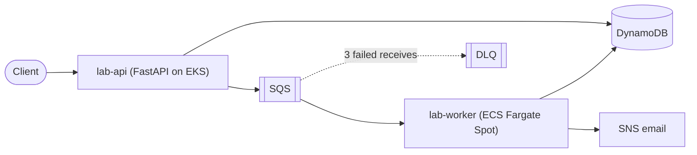
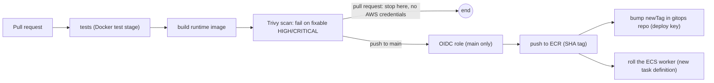

# cloud-lab-platform-app

The application half of **cloud-lab-platform**: a lab-environment request **API**, an asynchronous **worker**,
their tests and Dockerfiles, and the CI pipeline that builds, scans and ships them.

Part of a three-repository platform:
[infra](https://github.com/amerveus/cloud-lab-platform-infra) (Terraform, Ansible, ADRs, runbooks) |
**app** (this repo) |
[gitops](https://github.com/amerveus/cloud-lab-platform-gitops) (what runs in the clusters).



## The services

### lab-api (`api/`)

| Endpoint | Behavior |
|---|---|
| `POST /labs` | Body `{"student_id": "...", "lab_type": "..."}`. Stores a `PENDING` record, enqueues a job, returns a `request_id` |
| `GET /labs/{request_id}` | Returns the record. Status moves `PENDING`, `PROVISIONING`, `READY` |
| `GET /healthz` | Liveness and readiness probe target |
| `GET /metrics` | Prometheus metrics (see below) |
| `GET /chaos/error` | Fault injection for alert demos. Returns **404** unless fault injection is enabled **and** the `X-Chaos-Token` header matches (constant-time comparison); then returns 500. Fails closed if no token is configured |

Design notes:

- **Metrics use route templates** (`/labs/{request_id}`), and unknown paths collapse into `route="unmatched"`,
  so label cardinality stays bounded no matter what scanners request.
- Metrics: `http_requests_total{method,route,status}`, `http_request_duration_seconds` (histogram), and
  `lab_requests_created_total`.
- Structured JSON logs; health-check lines are filtered out of the access log.
- AWS clients are cached; credentials come from EKS Pod Identity (no keys in the image).

### lab-worker (`worker/`)

- Long-polls SQS and **deletes a message only after success**. A failure leaves it invisible for the visibility
  timeout, after which it reappears; after three receives SQS moves it to the DLQ. No retry code is needed.
- **Idempotent:** record updates are conditional (only advance from the expected status).
- **SIGTERM-safe:** on shutdown it stops taking messages and finishes the current one, so a Spot interruption or
  scale-in never half-processes a job.
- A `poison-test` lab type always fails, which exercises the DLQ path on demand.
- Publishes an SNS notification when a lab becomes `READY`.

## Configuration

| Variable | Used by | Meaning |
|---|---|---|
| `AWS_REGION` | both | Region |
| `TABLE_NAME` | both | DynamoDB table |
| `QUEUE_URL` | both | SQS jobs queue |
| `TOPIC_ARN` | worker | SNS topic for notifications |
| `LOG_LEVEL` | api | Log verbosity |
| `CHAOS_ENABLED` | api | Enables the fault-injection endpoint |
| `CHAOS_TOKEN` | api | Required header value when enabled (from Secrets Manager via External Secrets) |

## Run it locally

`local/docker-compose.yml` starts the API, the worker, **DynamoDB Local** and **ElasticMQ** (an SQS-compatible
queue), with per-service endpoint variables so boto3 talks to the local stand-ins. An init step waits for the
dependencies and creates the table and queue.

```bash
cd local
docker compose up --build
# create a lab and watch it go PENDING -> READY (see the ports section of docker-compose.yml)
```

## Tests

Tests run **inside the image build**, so a failing test fails `docker build`:

```bash
docker build --target test api        # 6 API tests (moto-backed)
docker build --target test worker     # 3 worker tests, including the poison-message path
```

Dockerfiles are multi-stage: `base` (patched OS packages, locked dependencies) then `test` then `runtime`
(non-root user, UID 10001). `requirements.lock` is generated **inside the Linux image**, never on a Mac, so the
resolved packages match what CI builds.

## CI pipeline (`.github/workflows/ci.yml`)



- **Pull requests** build, test and scan but are **never given AWS credentials**: the CI role trusts only the
  `main` branch subject.
- **Required checks** (`build-api`, `build-worker`) must pass, and they are pinned to the GitHub Actions app so
  nothing else can post a fake pass.
- All actions are pinned to **commit SHAs** (tags are mutable; a force-pushed `trivy-action` tag incident is
  the reason).
- Images are pushed to a shared ECR registry with **immutable tags** and scan on push; dev and prod run the
  same digest.
- The Trivy gate caught a real HIGH CVE in the Debian layer (`libpcre2`). The fix was `apt-get upgrade` in the
  base stage, not weakening the gate.

## Known gaps

- **Dual write:** the API writes DynamoDB, then sends to SQS. If the send fails the record stays `PENDING` with
  no job. Fix: a transactional outbox (DynamoDB Streams, EventBridge Pipe, SQS).
- No terminal `FAILED` status: a job that ends in the DLQ leaves its record `PENDING`.
- The API is unauthenticated (rate-limited at the WAF).
- The error-ratio alert should exclude `/metrics` and require a minimum request rate.

## Operational note

The deploy jobs target the **dev** environment. While dev is torn down, `deploy-worker-dev` fails by design (there
is no cluster or service to roll). For documentation-only merges, put `[skip ci]` in the **squash commit
subject** (not in the PR commits, or the required checks would never report).
